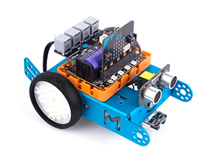

# mBridge //RJ-BIT

Extension for RJ25 based module extensions


## License

MIT

## Supported targets

* for PXT/microbit
* for PXT/arcade
(The metadata above is needed for package search.)

```package
powerbrick=github:Kittenbot/pxt-mbridge
```
